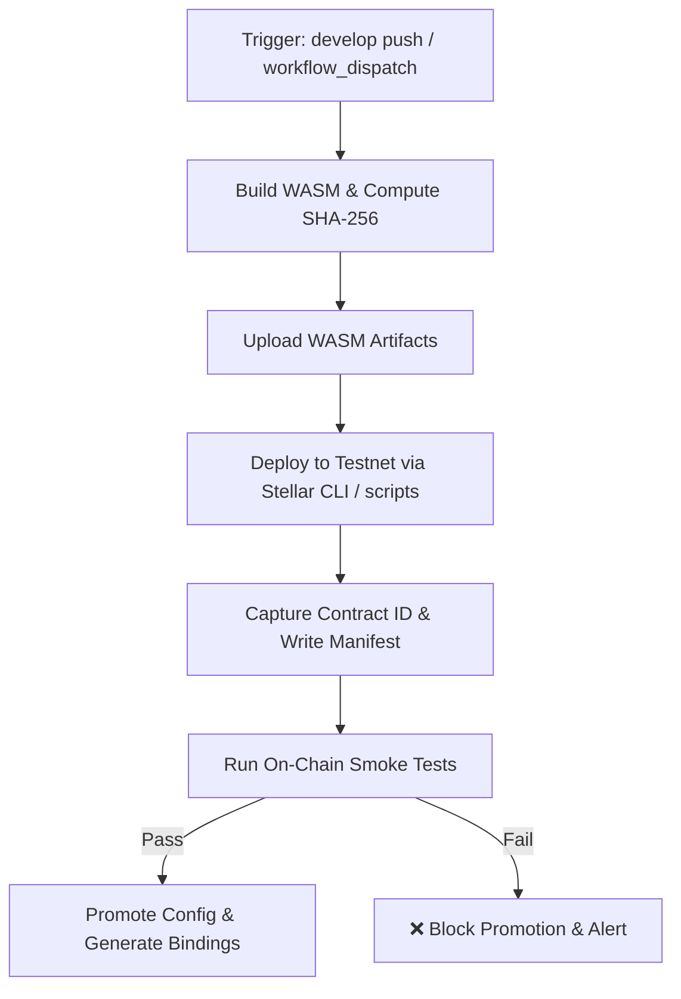

# Reproducible Smart Contract Testnet Deployment Workflow

This document describes the automated, reproducible Stellar Soroban smart contract deployment workflow for Lumigift on **Stellar Testnet**.

---

## Overview & Architecture

The testnet deployment workflow (`.github/workflows/deploy-contract-testnet.yml`) automates:
1. **Reproducible Compilation & Checksum Verification**: Builds optimized WASM bytecode from `contracts/escrow` and generates a cryptographic SHA-256 fingerprint.
2. **Deterministic Deployment & ID Capture**: Deploys the contract to Stellar Testnet and captures the resulting Contract ID (`C...`).
3. **Structured Manifest Artifacting**: Publishes machine-readable deployment metadata to `deployment-testnet.json`, updates `.contract-ids.json`, and records audit logs to `deployments.log`.
4. **On-Chain Smoke Testing**: Validates bytecode execution, RPC responsiveness, entry-point routing (`get_state`, `get_status`), and error codes against the live contract.
5. **Promotion Gating**: Automatically halts pipeline execution if any smoke test fails, guaranteeing defective contracts never reach staging or production.



---

## Acceptance Criteria Verification

| Requirement | Implementation | Validation |
| --- | --- | --- |
| **Automate Build** | `npm run contract:build` + SHA-256 checksum in CI | Optimized `lumigift_escrow.wasm` + `.sha256` generated |
| **ID Capture** | `scripts/deploy-contract.ts --json` | Written to `deployment-testnet.json`, `.contract-ids.json`, and step summary |
| **Config Publication** | `deployment-testnet.json` + Typed client bindings | Updated `src/lib/contracts/escrow-client.ts` artifacted |
| **Smoke Tests** | `scripts/smoke-test-contract.ts` | 5 on-chain tests run against deployed contract |
| **Deployment Output Artifacted** | `actions/upload-artifact` | WASM, deployment manifest, logs, and test reports retained |
| **Smoke Failure Blocks Promotion** | `promote-configuration` job `needs: [smoke-tests]` | `if: success()` strictly requires all smoke tests to pass |

---

## Deployment Artifacts

Every run produces the following artifacts in GitHub Actions:

1. **`escrow-wasm-artifact`**:
   - `lumigift_escrow.wasm`: The compiled WebAssembly bytecode.
   - `lumigift_escrow.wasm.sha256`: Cryptographic checksum for release verification.
2. **`deployment-artifacts`**:
   - `deployment-testnet.json`: Complete deployment manifest (JSON).
   - `.contract-ids.json`: Network-to-contract-address mapping.
   - `deployments.log`: Append-only audit trail of all deployments.
3. **`smoke-test-report`**:
   - `smoke-test-report.json`: Detailed pass/fail report with durations and RPC metadata.
4. **`contract-bindings`**:
   - `src/lib/contracts/escrow-client.ts`: TypeScript client generated from contract ABI.

### Deployment Manifest Schema (`deployment-testnet.json`)

```json
{
  "network": "testnet",
  "contractId": "CA...",
  "wasmPath": "contracts/target/wasm32-unknown-unknown/release/lumigift_escrow.wasm",
  "wasmHash": "d5a8b79f...",
  "deployerPublicKey": "GA...",
  "rpcUrl": "https://soroban-testnet.stellar.org",
  "explorerUrl": "https://stellar.expert/explorer/testnet/contract/CA...",
  "deployedAt": "2026-09-28T12:00:00.000Z",
  "verified": true
}
```

---

## On-Chain Smoke Tests

The smoke test suite (`scripts/smoke-test-contract.ts`) verifies:

1. **Contract ID StrKey Format**: Confirms 56-character base32 format starting with `C`.
2. **Soroban RPC Connectivity & Ledger Sequence**: Verifies RPC server health and fetches current ledger.
3. **Contract Instance Execution (`get_state`)**: Proves bytecode is loaded in Soroban VM and returns expected uninitialized response (`EscrowError::NotInitialized = 4`).
4. **Contract Status Routing (`get_status`)**: Proves method dispatcher functions properly on-chain.
5. **Report Generation**: Writes `smoke-test-report.json` and exits with code `0` on success or code `1` on failure.

---

## Running Locally

### 1. Build Contract

```bash
npm run contract:build
```

### 2. Deploy to Testnet

```bash
export STELLAR_SERVER_SECRET_KEY="S..."
export STELLAR_NETWORK="testnet"
npm run contract:deploy
```

To output raw JSON:
```bash
npm run contract:deploy -- --json
```

### 3. Run Smoke Tests

```bash
npm run contract:smoke
```

Or target a specific contract address:
```bash
npm run contract:smoke -- --contract-id CA... --network testnet
```

### 4. Regenerate Bindings

```bash
npm run contract:bindings
```
